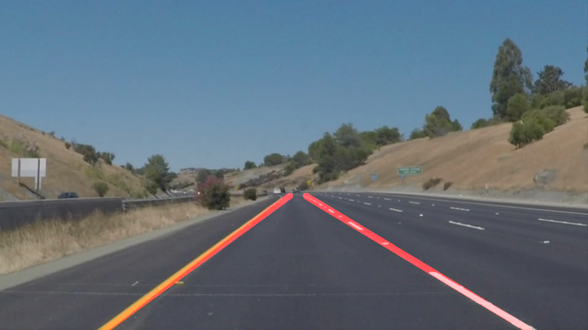

# LaneDetectionSDCN
Lane detection using OpenCV for Udacity Self Driving Car Nanodegree

### Overview
The repository contains the jupyter notebook implementing the pipeline for detecting lane lines on the road using the pictures and videos provided. The pipeline uses OpenCV functions to detect lines, and some post-processing scripts to ensure that single lines are drawn over the lines or the segments of the lines on each side of the field of view. 

An example picture is shown below. 

### Files and directories content
- `P1.ipynb` is a jupyter notebook containing all of the code. The first part works on the pictures, and the second on the videos. 
- `test_images` and `test_videos` provide input images and videos, respectively, for testing the pipeline
- `test_images_output` and `test_videos_output` contain output images and videos, respectively. The outputs using the current code are provided in these directories for review/reference.
- `writeup.md` provides more details on the processing pipeline

### How to run the code
To run the code, simply clone the repository, and run the command `jupyter notebook` from the directory containin the notebook _P1.ipynb_. 

The code has been tested using:
- Python 3.6.3 under Anaconda3 and Windows 8.1
- OpenCV 3.3.1
- ffmpeg library build ffmpeg-20180102-57d0c24-win64-static

### Known limitations and issues
- If you see the error `[WinError 6] The handle is invalid` appearing in the output cell of your notebook when running the video processing examples, restart jupyter and rerun the notebook. 
- The pipeline does not produce good results on the video `challenge.mp4`, as the drawn lines are completely off. This is work in progress. 

### Where to find more information
- The file `writeup.md` provides more information on the processing pipeline
- OpenCV documentation and tutorials can be found on the [OpenCV website](https://opencv.org/)
- More information on the original assignment can be found in the original [github repository](https://github.com/udacity/CarND-LaneLines-P1)
